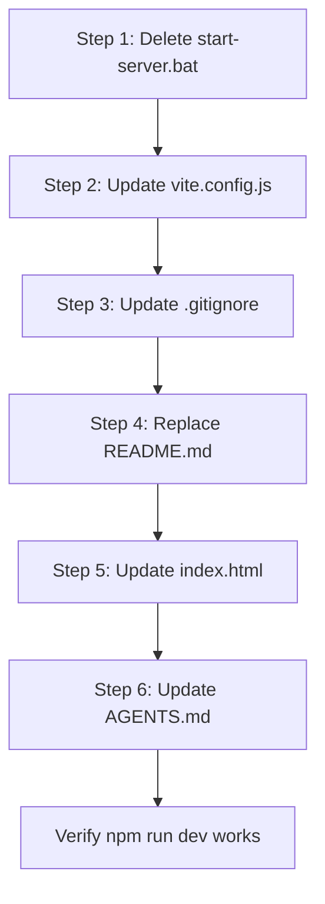

# Migration Plan: OpenCode/WSL to Roo/Native Windows

## Overview

This plan outlines the steps to clean up the `dm-util-app` project from its previous OpenCode/WSL-managed state and prepare it for native Windows management under Roo.

## Current State Analysis

The project is a React + Vite dice roller application for tabletop RPGs. After analysis, the following WSL/OpenCode-specific artifacts were identified:

| File | Issue | Action |
|------|-------|--------|
| `start-server.bat` | WSL-specific batch file | **Delete** |
| `vite.config.js` | Base path `/DM-Tool/` doesn't match project name | **Update** |
| `.gitignore` | Contains project-specific WSL files | **Update** |
| `README.md` | Generic Vite template text | **Replace** |
| `index.html` | Generic title | **Update** |
| `AGENTS.md` | Needs Roo context update | **Update** |

## Migration Steps

### Step 1: Delete WSL-Specific Files

**File to delete:** `start-server.bat`

This batch file runs the dev server through WSL:
```batch
@echo off
wsl -e bash -c "cd /home/crnor/dm-util-app && npm run dev"
pause
```

Since the project will now run natively on Windows, this file is unnecessary.

### Step 2: Update vite.config.js

**Current:**
```js
base: '/DM-Tool/',
```

**Proposed:**
```js
base: '/dm-util-app/',
```

The base path should match the repository name for GitHub Pages deployment.

**Question:** What is the name of the GitHub Pages repository where this app will be deployed? If it's `dm-util-app` instead of `DM-Tool`, the base path needs updating.

### Step 3: Update .gitignore

**Remove these lines:**
```
error.txt
start-server.bat
*.png:Zone.Identifier
```

These are project-specific files related to the WSL workflow. The `start-server.bat` will be deleted in Step 1. `error.txt` appears to be a debug artifact. `*.png:Zone.Identifier` is a Windows zone attribute that isn't typically needed in `.gitignore`.

### Step 4: Replace README.md

**Current:** Generic Vite template README.

**Proposed content:**
- Project name and description
- Features list
- Installation instructions
- Usage instructions
- Dice command syntax
- Tech stack
- Development commands

### Step 5: Update index.html

**Current:**
```html
<title>dm-util-app</title>
```

**Proposed:**
```html
<title>DM Util - Dice Roller & Combat Tracker</title>
```

A more descriptive title for end users.

### Step 6: Update AGENTS.md

Update the header and any references to reflect that Roo is now managing the project. Consider renaming from "Agent Guidelines" to "Project Guidelines" or similar.

## Optional Improvements

These are not required for migration but are recommended:

1. **Update app title in index.html** - More descriptive than folder name
2. **Favicon** - The current favicon is the default Vite SVG; consider a custom one
3. **Meta description** - Add SEO meta tags to `index.html`

## Execution Order



## Files to be Modified

1. `vite.config.js` - Change base path
2. `.gitignore` - Remove WSL-specific entries
3. `README.md` - Complete rewrite with project docs
4. `index.html` - Update title
5. `AGENTS.md` - Update header/context

## Files to be Deleted

1. `start-server.bat` - WSL batch file

## Questions for User

1. **GitHub Pages repository name:** Is the deployment repository named `dm-util-app` or `DM-Tool`? This determines the correct base path in `vite.config.js`.
2. **App display name:** Do you have a preferred display name for the app? Current references vary between "dm-util-app", "DM-Tool", and "DM Util".
