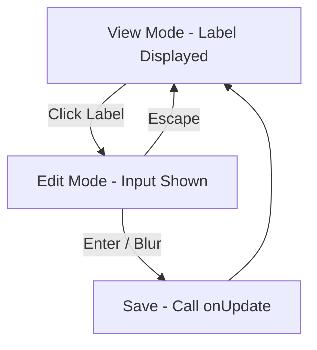

# Quality of Life Changes Plan

## Overview

Four QOL improvements to the saved rolls and combatant tracker components.

---

## Change 1: Inline Editing for Saved Roll Labels

**Goal:** Replace the edit button in SavedRollItem with click-to-edit inline editing, matching the CombatantCard pattern.

### Current Behavior
- SavedRollItem displays label as plain `<h3>` text
- Edit button (pencil icon) opens EditLabelModal dialog
- Modal requires separate save/cancel interaction

### Target Behavior
- Click/tap the label to enter edit mode
- Label becomes an inline `<input>` with `autoFocus`
- Press Enter or blur to save
- Press Escape to cancel (restore original)
- Edit button removed from the action buttons row

### Files to Modify

1. **[`src/components/SavedRolls/SavedRollItem.jsx`](src/components/SavedRolls/SavedRollItem.jsx)**
   - Add state: `isEditing`, `editValue` (using `useState`)
   - Replace label `<h3>` with conditional rendering:
     - Edit mode: `<input>` with `autoFocus`, `onBlur`, `onKeyDown` handlers
     - View mode: `<button>` wrapping the label text (like CombatantCard name)
   - Add handlers: `handleEditStart()`, `handleEditSave()`, `handleEditCancel()`
   - Remove the edit button from the action buttons row
   - Change `onEdit` prop usage: remove it, use `onUpdate` instead (which is already passed from SavedRollsPanel)

2. **[`src/components/SavedRolls/SavedRollsPanel.jsx`](src/components/SavedRolls/SavedRollsPanel.jsx)**
   - Remove `editingRoll` state and `EditLabelModal` usage
   - Remove `handleEdit`, `handleCloseModal` functions
   - Pass `onUpdate` directly to `SavedRollItem` (rename from `onEdit` to `onUpdate`)
   - Remove `EditLabelModal` import

3. **[`src/components/SavedRolls/EditLabelModal.jsx`](src/components/SavedRolls/EditLabelModal.jsx)**
   - Can be deleted (no longer needed) OR kept as dead code

### State Flow



---

## Change 2: Auto-Select Text on Edit Focus

**Goal:** When entering edit mode, the text in the input field should be automatically selected for easy replacement.

### Exception
- Combatant description/notes textarea should NOT auto-select (as specified by user)

### Files to Modify

1. **[`src/components/SavedRolls/SavedRollItem.jsx`](src/components/SavedRolls/SavedRollItem.jsx)**
   - Add `useRef` for the input element
   - Add `useEffect` that selects text when `isEditing` becomes true:
   ```js
   const inputRef = useRef(null);
   
   useEffect(() => {
     if (isEditing && inputRef.current) {
       inputRef.current.select();
     }
   }, [isEditing]);
   ```

2. **[`src/components/CombatantTracker/CombatantCard.jsx`](src/components/CombatantTracker/CombatantCard.jsx)**
   - Add auto-select for name input, current HP input, and max HP input
   - Add `useRef` for each editable field
   - Add `useEffect` for each to select text on edit mode enter
   - Do NOT add auto-select for the description textarea (exception)

---

## Change 3: Empty Damage Field Placeholder

**Goal:** Remove the "5" placeholder text from the combatant damage input field.

### Files to Modify

1. **[`src/components/CombatantTracker/CombatantCard.jsx`](src/components/CombatantTracker/CombatantCard.jsx)** (line 220)
   - Change: `placeholder="5"` to `placeholder=""`

---

## Change 4: Auto-Switch to Dice Tab on Mobile After Saved Roll

**Goal:** When a roll is made from a saved roll while in mobile tabbed view, automatically switch to the dice tab so the user can see the result.

### Current Behavior
- User can be on "Saved" tab
- User taps roll button on a saved roll
- Roll result is not visible because user stays on "Saved" tab

### Target Behavior
- When `onRoll` is called from SavedRollsPanel in mobile/tablet mode, also switch to the "dice" tab

### Files to Modify

1. **[`src/App.jsx`](src/App.jsx)**
   - Create a wrapper `handleRollFromSaved` function that:
     - Calls `handleRollSubmit(command)`
     - Calls `setActivePanel('dice')` to switch to dice tab
   - Pass this wrapper to `SavedRollsPanel` instead of `handleRollSubmit`
   - Apply to all three layout modes (desktop, tablet, mobile) where SavedRollsPanel is rendered

   ```js
   const handleRollFromSaved = (command) => {
     handleRollSubmit(command);
     setActivePanel('dice');
   };
   ```

2. **[`src/components/SavedRolls/SavedRollsPanel.jsx`](src/components/SavedRolls/SavedRollsPanel.jsx)**
   - Rename prop from `onRoll` to something clearer if needed (or keep as-is since it's already `onRoll`)
   - No changes needed here - the tab switching is handled at the App level

---

## Implementation Order

1. **Change 3** (Damage placeholder) - Single line change, lowest risk
2. **Change 1** (Inline editing for saved rolls) - Core UI change
3. **Change 2** (Auto-select text) - Enhancement to inline editing
4. **Change 4** (Auto-switch tab) - Navigation behavior change

Changes 1 and 2 can be combined into a single implementation pass since they affect the same file.

---

## Summary of File Changes

| File | Changes |
|------|---------|
| [`src/components/SavedRolls/SavedRollItem.jsx`](src/components/SavedRolls/SavedRollItem.jsx) | Add inline editing state, replace label with clickable button+input, add auto-select, remove edit button |
| [`src/components/SavedRolls/SavedRollsPanel.jsx`](src/components/SavedRolls/SavedRollsPanel.jsx) | Remove EditLabelModal usage, clean up edit state |
| [`src/components/SavedRolls/EditLabelModal.jsx`](src/components/SavedRolls/EditLabelModal.jsx) | Delete (no longer needed) |
| [`src/components/CombatantTracker/CombatantCard.jsx`](src/components/CombatantTracker/CombatantCard.jsx) | Empty damage placeholder, add auto-select to editable fields |
| [`src/App.jsx`](src/App.jsx) | Add `handleRollFromSaved` wrapper that switches to dice tab |